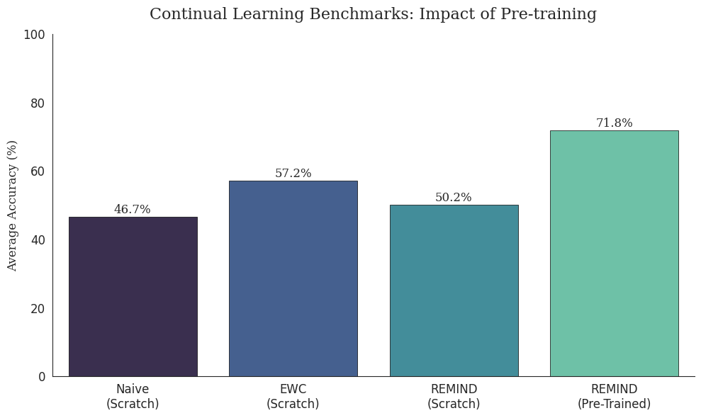

# Analysis of "Cold Start" Failure Modes in Latent Replay (REMIND)

**Author:** Nigel Nguyen (University of Rochester)  

## Summary
This project investigates the robustness of [**REMIND**](https://arxiv.org/abs/1910.02509) (Hayes et al., 2020) in resource-constrained, "train-from-scratch" regimes.

**The Hypothesis:** Latent Replay methods depend heavily on the stability of the feature extractor to generate valid memory indices.  

**The Finding:** In scratch-training scenarios (Split-CIFAR10), REMIND suffers from a **"Cold Start" failure mode**, barely outperforming Naive baselines and underperforming simple regularization methods (EWC). This occurs because the Product Quantizer (PQ) effectively compresses "noise" from the immature feature extractor.  

**The Validation:** Performance is recovered only when the backbone is initialized with mature features (ImageNet) and input resolution is corrected to match the pre-training architecture.

## Results
The chart below illustrates the performance gap between "Scratch" training and "Pre-trained" validation.



| Method | Backbone Mode | Input Resolution | Avg Accuracy | Observation |
| :--- | :--- | :--- | :--- | :--- |
| **Naive** | Scratch | 32x32 | 46.7% | Lower bound (catastrophic forgetting). |
| **REMIND** | Scratch | 32x32 | **50.2%** | Barely outperforms Naive; worse than EWC. |
| **EWC** | Scratch | 32x32 | **57.2%** | More robust to immature features. |
| **REMIND** | Pre-Trained | 224x224 | **71.8%** | SOTA performance recovered via feature maturity. |

## Reproduction
This repository contains a unified training script to reproduce both the failure mode and the validation success.

### 1. Install Dependencies
```bash
pip install -r requirements.txt
```

### 2. Reproduce the Failure (Scratch Training)
This runs REMIND on standard CIFAR-10 (32x32) without pre-training.
```bash
python main.py --strategy REMIND --batch_size 256 --seed 42
```

### 3. Reproduce the Success (Pre-trained Validation)
This enables the ImageNet backbone and native resolution upsampling.
```bash
python main.py --strategy REMIND --pretrained --epochs 5 --batch_size 64 --seed 42
```

